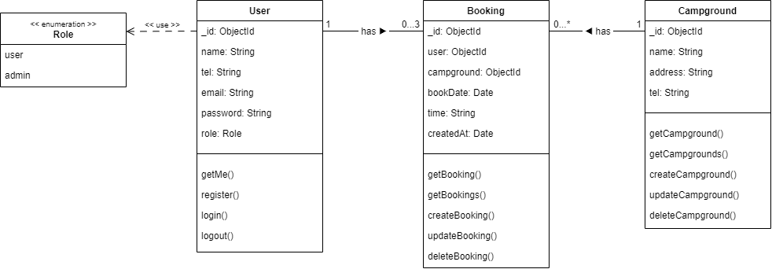

# Campground Booking

Project# 2

---

<!-- _class: lead -->

## Use Case Diagram

<!--
style: |
    section.lead h2 {
        top: 2%;
        position: absolute;
        height: 1rem;
        text-decoration: underline;
        font-size: 1em;
    }
    section.lead img {
        aspect-ratio: auto;
        width: 100%;
    }
-->

---

<!-- _class: lead -->

## Class Diagram

---

<!-- _class: lead -->

## Sequence Diagram (Get All)

.png>)

---

<!-- _class: lead -->

## Sequence Diagram (Get One)

.png>)

---

<!-- _class: lead -->

## Sequence Diagram (Create)

.png>)

---

<!-- _class: lead -->

## Sequence Diagram (Update)

.png>)

---

<!-- _class: lead -->

## Sequence Diagram (Delete)

.png>)
